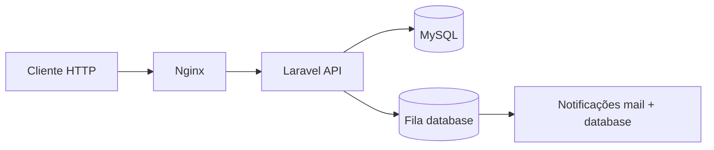

# Documentação técnica — Onfly Travel Orders API

Bem-vindo à documentação técnica do projeto. Este índice organiza os guias por tema.

## Visão geral do sistema

A Onfly é uma API REST para **gestão de pedidos de viagem corporativa**. Usuários autenticados criam pedidos de viagem; administradores aprovam ou cancelam. O sistema notifica o solicitante por e-mail e canal in-app quando o status muda.



## Documentos

| Documento | Descrição |
|-----------|-----------|
| [architecture.md](architecture.md) | Camadas da Clean Architecture, padrões, fluxo de requisições, autenticação e injeção de dependências |
| [database.md](database.md) | Schema do banco, migrations, relacionamentos, modelos Eloquent e seeders |
| [domain.md](domain.md) | Regras de negócio, máquina de estados, autorização, eventos e filtros |
| [testing.md](testing.md) | Como executar testes, estrutura de suites, cobertura e boas práticas |
| [contributing.md](contributing.md) | Onde colocar código, convenções, checklist de PR e como adicionar features |

## Documentação da API (OpenAPI)

A especificação interativa dos endpoints **não** está duplicada aqui. Use o Scramble:

| Recurso | URL (desenvolvimento) |
|---------|----------------------|
| UI interativa | http://localhost:8080/docs/api |
| Spec JSON | http://localhost:8080/docs/api.json |

Instruções de acesso e autenticação estão no [README principal](../README.md#documentação-da-api-scramble).

## Setup rápido

```bash
cp .env.example .env
make setup
```

Detalhes completos no [README principal](../README.md).

## Estrutura do repositório

```
onfly/
├── app/
│   ├── Domain/           # Entidades, value objects, eventos, interfaces de repositório
│   ├── Application/      # Use cases, DTOs, ports, listeners
│   ├── Infrastructure/   # Eloquent, adapters, repositórios
│   ├── Http/             # Controllers, requests, resources, middleware
│   ├── Policies/         # Autorização
│   ├── Notifications/    # Notificações Laravel
│   └── Providers/        # Bindings de DI
├── database/
│   ├── migrations/
│   ├── seeders/
│   └── factories/
├── docs/                 # Esta documentação
├── docker/               # Dockerfile e config Nginx
├── routes/               # api.php, web.php
├── tests/                # Unit, Integration, Feature
└── README.md             # Guia de desenvolvimento
```
