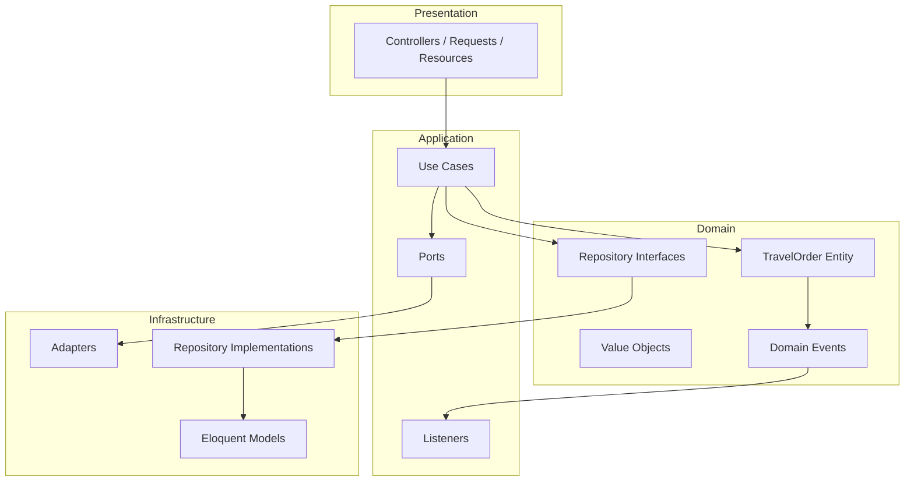
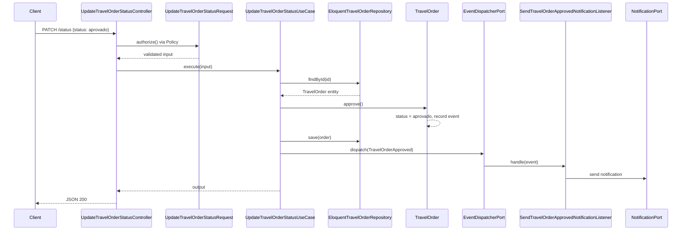

# Arquitetura

Este documento descreve a arquitetura do projeto Onfly Travel Orders API.

## Princípio fundamental

O projeto segue **Clean Architecture** (Robert C. Martin) com influências de **DDD**. A regra de dependência é clara: **código interno nunca depende de código externo**.

```
Presentation (Http)  →  Application  →  Domain  ←  Infrastructure
```

- **Domain** é o centro — PHP puro, sem imports de framework
- **Application** orquestra casos de uso — depende de Domain + ports (interfaces)
- **Infrastructure** implementa ports — Eloquent, Sanctum, filas, notificações
- **Http** adapta HTTP para Application — controllers finos

## Diagrama de camadas



## Bounded contexts

O projeto possui dois contextos principais:

### TravelOrder (domínio rico)

Pedidos de viagem com aggregate root, value objects, eventos de domínio e repositório com interface no Domain. Toda regra de negócio (transições de status, validação de período) vive aqui.

### Auth (aplicação + ports)

Autenticação e registro de usuários **não** possuem entidade de domínio. O usuário é modelado como DTO (`AuthUserDto`) e ports (`UserAuthenticationPort`, `ApiTokenPort`, etc.), com implementações em Infrastructure usando Eloquent e Sanctum. Abordagem pragmática para integração com Laravel.

## Camadas em detalhe

### Domain (`app/Domain/`)

Responsável por regras de negócio, invariantes e linguagem ubíqua.

| Componente | Exemplo | Localização |
|------------|---------|-------------|
| Aggregate Root | `TravelOrder` | `Domain/TravelOrder/Entities/` |
| Value Objects | `TravelOrderId`, `Destination`, `TravelPeriod`, `TravelOrderStatus` | `Domain/TravelOrder/ValueObjects/` |
| Domain Events | `TravelOrderApproved`, `TravelOrderCancelled` | `Domain/TravelOrder/Events/` |
| Repository Interface | `TravelOrderRepositoryInterface` | `Domain/TravelOrder/Repositories/` |
| Criteria | `ListTravelOrdersCriteria` | `Domain/TravelOrder/Criteria/` |
| Exceptions | `InvalidTravelOrderStateException` | `Domain/TravelOrder/Exceptions/` |

**Regras:**
- Sem imports de `Illuminate\*`, Eloquent ou HTTP
- Entidades encapsulam estado — mudanças via métodos de comportamento (`approve()`, `cancel()`)
- Eventos acumulados no aggregate e drenados via `pullDomainEvents()`

### Application (`app/Application/`)

Orquestra casos de uso. **Não contém regras de negócio** — apenas coordena domínio, repositórios e ports.

#### Use Cases

| Use Case | Responsabilidade |
|----------|------------------|
| `CreateTravelOrderUseCase` | Cria pedido para usuário autenticado |
| `ListTravelOrdersUseCase` | Lista com filtros; escopo por admin/user |
| `ShowTravelOrderUseCase` | Detalhe com checagem de ownership |
| `UpdateTravelOrderStatusUseCase` | Aprova/cancela + dispatch de eventos |
| `LoginUserUseCase` | Autentica e emite token Sanctum |
| `RegisterUserUseCase` | Registra novo usuário |
| `LogoutUserUseCase` | Revoga token atual |
| `WebLoginAdminUseCase` | Login web com sessão; exige `is_admin` |

Cada use case expõe um método `execute(InputDTO): OutputDTO`.

#### Ports (`app/Application/Ports/`)

Interfaces para infraestrutura externa:

| Port | Função |
|------|--------|
| `AuthenticatedUserPort` | Usuário autenticado na requisição atual |
| `UserAuthenticationPort` | Validação de credenciais |
| `UserRegistrationPort` | Registro de usuário |
| `ApiTokenPort` | Emissão/revogação de tokens Sanctum |
| `SessionAuthenticationPort` | Login web com sessão |
| `EventDispatcherPort` | Dispatch de eventos de domínio |
| `NotificationPort` | Envio de notificações |
| `TravelOrderPersistenceFacadeInterface` | Persistência com tradução Eloquent ↔ Domain |
| `TravelOrderListQueryPort` | Consultas de listagem com filtros |

#### Listeners

| Listener | Evento | Ação |
|----------|--------|------|
| `SendTravelOrderApprovedNotificationListener` | `TravelOrderApproved` | Notifica solicitante |
| `SendTravelOrderCancelledNotificationListener` | `TravelOrderCancelled` | Notifica solicitante |

### Infrastructure (`app/Infrastructure/`)

Implementações concretas de interfaces do Domain e Application.

| Componente | Exemplo |
|------------|---------|
| Eloquent Models | `TravelOrderModel`, `UserModel` |
| Repositories | `EloquentTravelOrderRepository` |
| Query Adapters | `EloquentTravelOrderListQueryAdapter` |
| Auth Adapters | `SanctumApiTokenAdapter`, `EloquentUserAuthenticationAdapter` |
| Facades | `TravelOrderPersistenceFacade`, `TravelOrderEloquentTranslator` |

**Importante:** modelos Eloquent são **modelos de persistência**, não entidades de domínio. A tradução entre camadas é feita por mappers/translators.

### Presentation (`app/Http/`)

Adapta HTTP para use cases.

| Componente | Padrão |
|------------|--------|
| Controllers | Single-action (`__invoke`) — finos, sem lógica de negócio |
| Form Requests | Validação de input (`StoreTravelOrderRequest`, etc.) |
| API Resources | Transformação de output (`TravelOrderResource`, `UserResource`) |
| Middleware | `EnsureUserIsAdmin`, `EnsureApiDocsAccess` |
| OpenApi | Schemas e extensões Scramble |

## Fluxo de requisição: aprovar pedido

Exemplo completo de `PATCH /api/v1/travel-orders/{id}/status`:



## Injeção de dependências

Bindings registrados em `RepositoryServiceProvider`:

| Interface | Implementação |
|-----------|---------------|
| `TravelOrderRepositoryInterface` | `EloquentTravelOrderRepository` |
| `AuthenticatedUserPort` | `SanctumAuthenticatedUserAdapter` |
| `UserAuthenticationPort` | `EloquentUserAuthenticationAdapter` |
| `UserRegistrationPort` | `EloquentUserRegistrationAdapter` |
| `ApiTokenPort` | `SanctumApiTokenAdapter` |
| `SessionAuthenticationPort` | `LaravelSessionAuthenticationAdapter` |
| `TravelOrderPersistenceFacadeInterface` | `TravelOrderPersistenceFacade` |
| `NotificationPort` | `LaravelNotificationAdapter` |
| `EventDispatcherPort` | `LaravelEventDispatcherAdapter` |
| `TravelOrderEloquentTranslatorInterface` | `TravelOrderEloquentTranslator` |
| `TravelOrderListQueryPort` | `EloquentTravelOrderListQueryAdapter` |

Event listeners registrados em `EventServiceProvider`.

## Autenticação e autorização

### Dual channel

| Canal | Mecanismo | Uso |
|-------|-----------|-----|
| API REST | Laravel Sanctum (Bearer token) | Endpoints `/api/v1/*` |
| Web | Sessão Laravel | Login admin em `/admin/login`, acesso à documentação |

### Autorização

| Mecanismo | Onde | Regra |
|-----------|------|-------|
| `TravelOrderPolicy` | `approve()`, `cancel()` | Apenas `is_admin = true` |
| Use case ownership | `ShowTravelOrderUseCase` | Usuário vê só os próprios; admin vê todos |
| Use case escopo | `ListTravelOrdersUseCase` | Admin lista todos; user filtrado por `userId` |
| Form Request | `UpdateTravelOrderStatusRequest::authorize()` | Delega à policy antes do use case |

## Tratamento de exceções

Centralizado em `bootstrap/app.php`, mapeando exceções de domínio/aplicação para respostas JSON:

| Exceção | HTTP |
|---------|------|
| Credenciais inválidas / não autenticado | 401 |
| Autorização negada / acesso a pedido alheio | 403 |
| Pedido não encontrado | 404 |
| Transição de status inválida | 409 |
| Validação / argumentos inválidos | 422 |
| Rate limit excedido | 429 |

## Rate limiting

Configurado em `config/rate-limiting.php` e registrado em `AppServiceProvider`. Limiters nomeados: `api`, `auth`, `web`, `web-login`, `docs`.

A documentação Scramble inclui extensão customizada (`RateLimitOperationExtension`) que documenta `x-rateLimit` e resposta `429` por endpoint.

## Documentação OpenAPI

Gerada automaticamente pelo **Scramble** (`dedoc/scramble`):

- UI: `/docs/api`
- Spec: `/docs/api.json`
- Middleware: `EnsureApiDocsAccess` (público em `local`, admin em outros ambientes)
- Security scheme Bearer configurado em `AppServiceProvider`

## Padrões utilizados

| Padrão | Onde |
|--------|------|
| Repository | Interface no Domain, Eloquent na Infrastructure |
| Ports & Adapters | `Application/Ports/` + `Infrastructure/Adapters/` |
| Use Case | Um caso de uso por ação de negócio |
| DTOs tipados | Input/Output por use case |
| Domain Events + Listeners | Aprovação/cancelamento → notificação |
| Policy-based authorization | `TravelOrderPolicy` + Form Request |
| Single-action controllers | Todos os controllers API usam `__invoke` |
| Criteria object | `ListTravelOrdersCriteria` para queries de listagem |
| Mapper/Facade de persistência | `TravelOrderPersistenceFacade` |

## Estrutura de rotas

```
/api/v1/                          [throttle:api]
├── auth/                         [throttle:auth]
│   ├── POST register
│   ├── POST login
│   └── POST logout               [auth:sanctum]
└── [auth:sanctum]
    ├── POST   travel-orders
    ├── GET    travel-orders
    ├── GET    travel-orders/{id}
    └── PATCH  travel-orders/{id}/status

Web:
├── GET|POST /admin/login         [guest, throttle:web-login]
├── POST     /admin/logout        [auth]
└── GET      /docs/api            [throttle:docs, EnsureApiDocsAccess]
```
