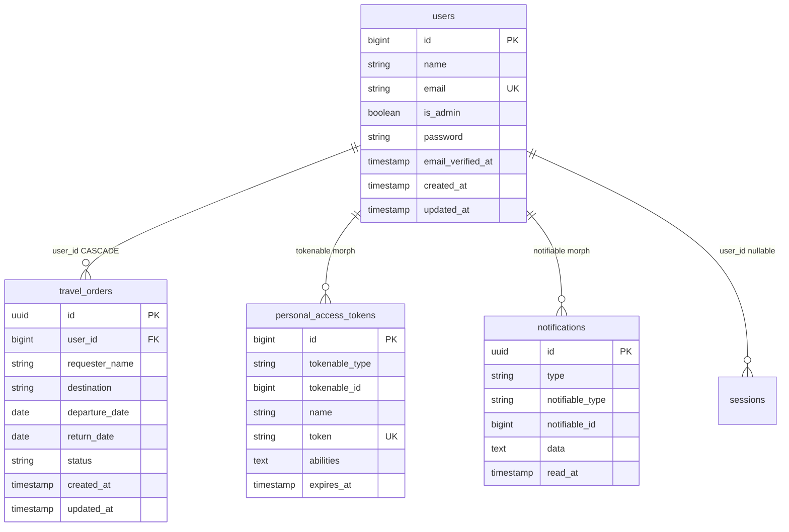

# Banco de dados

Este documento descreve o schema, migrations, modelos de persistência e seeders do projeto.

## Diagrama entidade-relacionamento



## Tabelas de domínio

### `users`

Migration: `0001_01_01_000000_create_users_table.php` + `2026_06_17_000001_add_is_admin_to_users_table.php`

| Coluna | Tipo | Constraints | Descrição |
|--------|------|-------------|-----------|
| `id` | `bigint` | PK, auto-increment | Identificador |
| `name` | `string` | NOT NULL | Nome do usuário |
| `email` | `string` | UNIQUE, NOT NULL | E-mail de login |
| `email_verified_at` | `timestamp` | nullable | Verificação de e-mail |
| `password` | `string` | NOT NULL | Senha hasheada |
| `is_admin` | `boolean` | default `false`, indexado | Permissão de administrador |
| `remember_token` | `string` | nullable | Token "lembrar-me" |
| `created_at` / `updated_at` | `timestamp` | — | Timestamps |

### `travel_orders`

Migration: `2026_06_17_000002_create_travel_orders_table.php`

| Coluna | Tipo | Constraints | Descrição |
|--------|------|-------------|-----------|
| `id` | `uuid` | PK | Identificador do pedido |
| `user_id` | `bigint` | FK → `users.id`, CASCADE DELETE | Solicitante |
| `requester_name` | `string` | NOT NULL | Nome do solicitante no pedido |
| `destination` | `string` | NOT NULL, indexado | Destino da viagem |
| `departure_date` | `date` | NOT NULL, indexado | Data de ida |
| `return_date` | `date` | NOT NULL | Data de volta |
| `status` | `string` | default `solicitado`, indexado | Status do pedido |
| `created_at` / `updated_at` | `timestamp` | — | Timestamps |

**Índices compostos:**
- `(status, departure_date)` — filtros por status e data de partida
- `(user_id, status)` — listagem de pedidos por usuário e status

**Status possíveis:** `solicitado` (default), `aprovado`, `cancelado`

### `personal_access_tokens` (Sanctum)

Migration: `2026_06_17_183338_create_personal_access_tokens_table.php`

Tabela padrão do Laravel Sanctum para tokens de API. Relação polimórfica com `users` via `tokenable_type` / `tokenable_id`.

| Coluna relevante | Descrição |
|------------------|-----------|
| `token` | Hash do token (64 chars, unique) |
| `abilities` | Permissões do token |
| `expires_at` | Expiração opcional |

### `notifications`

Migration: `2026_06_17_000003_create_notifications_table.php`

Notificações in-app (canal `database`). Relação polimórfica com `users` via `notifiable_type` / `notifiable_id`.

## Tabelas de infraestrutura Laravel

| Tabela | Migration | Propósito |
|--------|-----------|-----------|
| `password_reset_tokens` | `0001_01_01_000000` | Reset de senha |
| `sessions` | `0001_01_01_000000` | Sessões web (login admin) |
| `cache`, `cache_locks` | `0001_01_01_000001` | Cache em banco (`CACHE_STORE=database`) |
| `jobs`, `job_batches`, `failed_jobs` | `0001_01_01_000002` | Filas (`QUEUE_CONNECTION=database`) |

## Relacionamentos

| De | Para | Tipo | Comportamento |
|----|------|------|---------------|
| `travel_orders.user_id` | `users.id` | N:1 | CASCADE on delete |
| `personal_access_tokens.tokenable` | `users` | Polimórfico 1:N | — |
| `notifications.notifiable` | `users` | Polimórfico 1:N | — |
| `sessions.user_id` | `users.id` | N:1 (nullable) | — |

## Modelos Eloquent

Localizados em `app/Infrastructure/Persistence/Eloquent/`. São **modelos de persistência**, não entidades de domínio.

### `UserModel`

```php
// app/Infrastructure/Persistence/Eloquent/UserModel.php
```

| Aspecto | Detalhe |
|---------|---------|
| Tabela | `users` |
| Traits | `HasApiTokens` (Sanctum), `HasFactory`, `Notifiable` |
| Fillable | `name`, `email`, `password`, `is_admin` |
| Casts | `email_verified_at` → datetime, `password` → hashed, `is_admin` → boolean |
| Factory | `UserFactory` com states `admin()` e `unverified()` |

### `TravelOrderModel`

```php
// app/Infrastructure/Persistence/Eloquent/TravelOrderModel.php
```

| Aspecto | Detalhe |
|---------|---------|
| Tabela | `travel_orders` |
| PK | UUID (`$incrementing = false`, `$keyType = 'string'`) |
| Fillable | `id`, `user_id`, `requester_name`, `destination`, `departure_date`, `return_date`, `status` |
| Casts | `departure_date`, `return_date` → date |
| Relação | `belongsTo(UserModel::class, 'user_id')` |
| Factory | `TravelOrderModelFactory` com states `approved()` e `cancelled()` |

### Tradução Eloquent ↔ Domain

A conversão entre modelos Eloquent e entidades de domínio é feita por:

- `TravelOrderEloquentTranslator` — mapeia campos entre `TravelOrderModel` e `TravelOrder` entity
- `TravelOrderPersistenceFacade` — orquestra persistência via translator
- `EloquentTravelOrderRepository` — implementa `TravelOrderRepositoryInterface`

## Seeders

### `DatabaseSeeder`

Cria dois usuários fixos para desenvolvimento:

| Nome | E-mail | Senha | Admin |
|------|--------|-------|-------|
| Admin User | `admin@example.com` | `password` | sim |
| Test User | `test@example.com` | `password` | não |

Não há seed de `travel_orders` — use factories nos testes ou crie via API.

```bash
make seed
# ou
make artisan cmd="db:seed"
```

## Factories

| Factory | Model | States |
|---------|-------|--------|
| `UserFactory` | `UserModel` | `admin()`, `unverified()` |
| `TravelOrderModelFactory` | `TravelOrderModel` | `approved()`, `cancelled()` |

Exemplo em testes:

```php
$user = UserModel::factory()->create();
$order = TravelOrderModel::factory()->for($user)->approved()->create();
```

## Migrations

O projeto possui 7 migrations. **Nunca edite migrations já commitadas** — crie novas migrations para alterações.

```bash
make artisan cmd="migrate"
make artisan cmd="migrate:fresh --seed"   # reset completo + seed
```

## Configuração de testes

Em `phpunit.xml`, os testes usam **SQLite in-memory**:

```xml
<env name="DB_CONNECTION" value="sqlite"/>
<env name="DB_DATABASE" value=":memory:"/>
```

Isso garante testes rápidos e isolados, sem depender do MySQL do Docker.

## Convenções

- IDs de `travel_orders` são **UUIDs** gerados no domínio (`TravelOrderId::generate()`)
- IDs de `users` são **bigint auto-increment**
- Status é armazenado como `string`, validado no domínio via enum `TravelOrderStatus`
- Soft deletes **não** são utilizados nas tabelas de domínio
