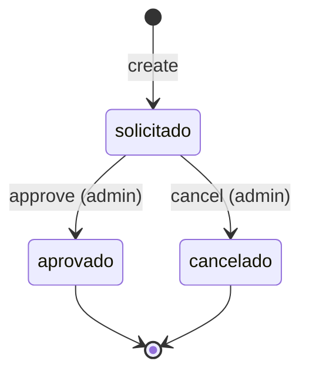
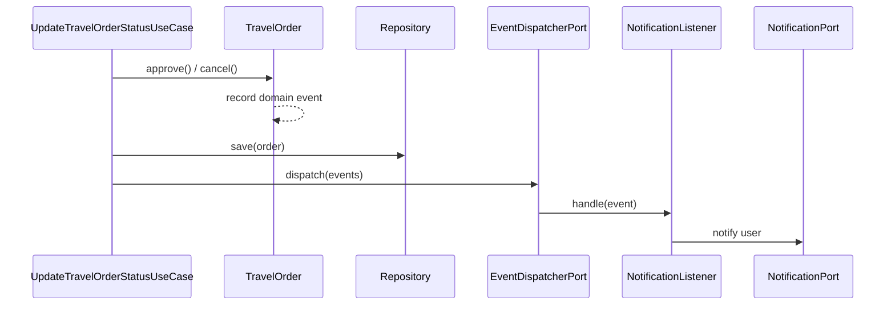

# Domínio e regras de negócio

Este documento descreve as regras de negócio, estados, autorização e eventos do bounded context **TravelOrder**.

## Aggregate: TravelOrder

O aggregate root `TravelOrder` encapsula todo o ciclo de vida de um pedido de viagem.

**Localização:** `app/Domain/TravelOrder/Entities/TravelOrder.php`

### Dados do pedido

| Campo | Value Object | Descrição |
|-------|--------------|-----------|
| ID | `TravelOrderId` | UUID gerado na criação |
| Solicitante | `UserId` | ID do usuário autenticado |
| Nome | `RequesterName` | Nome do solicitante |
| Destino | `Destination` | Destino da viagem |
| Período | `TravelPeriod` | Datas de ida e volta |
| Status | `TravelOrderStatus` | Estado atual do pedido |

### Criação

Todo pedido é criado com status `solicitado`:

```php
TravelOrder::create(
    userId: $userId,
    requesterName: $requesterName,
    destination: $destination,
    period: $period,
);
```

O ID é gerado automaticamente via `TravelOrderId::generate()`.

## Máquina de estados



| Status | Valor | Transições permitidas |
|--------|-------|----------------------|
| `solicitado` | Default na criação | → `aprovado`, → `cancelado` |
| `aprovado` | Estado final | Nenhuma |
| `cancelado` | Estado final | Nenhuma |

### Regras de transição

- Apenas pedidos em status `solicitado` podem ser aprovados ou cancelados
- Tentativa de transição inválida lança `InvalidTravelOrderStateException` → HTTP **409**
- Não é possível reverter para `solicitado` → HTTP **403**

A lógica está no aggregate:

```php
public function approve(): void
{
    if (! $this->status->isSolicitado()) {
        throw new InvalidTravelOrderStateException('Only requested orders can be approved.');
    }
    $this->status = TravelOrderStatus::Aprovado;
    $this->record(new TravelOrderApproved($this->id, $this->userId));
}
```

## Validações de domínio

### Período de viagem (`TravelPeriod`)

- A data de volta deve ser **igual ou posterior** à data de ida
- Violação lança `InvalidTravelPeriodException` → HTTP **422**

```php
if ($this->return < $this->departure) {
    throw new InvalidTravelPeriodException('Return date must be on or after departure date.');
}
```

### Value Objects

Cada value object valida seus invariantes no construtor:

| Value Object | Validação |
|--------------|-----------|
| `Destination` | Não vazio, tamanho máximo |
| `RequesterName` | Não vazio, tamanho máximo |
| `TravelOrderId` | UUID válido |
| `UserId` | ID numérico positivo |
| `TravelOrderStatus` | Valor do backed enum |

Validações de **formato de input** (tipos, campos obrigatórios) ficam nos Form Requests da camada Http. Validações de **regra de negócio** ficam no Domain.

## Autorização

### Papéis

| Papel | Identificação | Permissões |
|-------|---------------|------------|
| Usuário comum | `is_admin = false` | Criar pedidos; listar e visualizar **apenas os próprios** |
| Administrador | `is_admin = true` | Listar todos; visualizar qualquer pedido; **aprovar** e **cancelar** |

### Onde a autorização é aplicada

| Ação | Mecanismo | Local |
|------|-----------|-------|
| Aprovar pedido | `TravelOrderPolicy::approve()` | Form Request + Policy |
| Cancelar pedido | `TravelOrderPolicy::cancel()` | Form Request + Policy |
| Visualizar pedido | Ownership no use case | `ShowTravelOrderUseCase` |
| Listar pedidos | Escopo no use case | `ListTravelOrdersUseCase` |

### Policy

```php
// app/Policies/TravelOrderPolicy.php
public function approve(UserModel $user, TravelOrderModel $order): bool
{
    return $user->is_admin;
}
```

Usuário comum que tenta aprovar/cancelar recebe HTTP **403**.

Usuário comum que tenta visualizar pedido de outro recebe `UnauthorizedTravelOrderAccessException` → HTTP **403**.

## Eventos de domínio

Eventos são registrados dentro do aggregate e despachados pelo use case após persistência.

| Evento | Disparado quando | Dados |
|--------|------------------|-------|
| `TravelOrderApproved` | `$order->approve()` | `TravelOrderId`, `UserId` |
| `TravelOrderCancelled` | `$order->cancel()` | `TravelOrderId`, `UserId` |

### Fluxo de side effects



### Notificações resultantes

| Evento | Notificação | Canais |
|--------|-------------|--------|
| `TravelOrderApproved` | `TravelOrderApprovedNotification` | `mail`, `database` |
| `TravelOrderCancelled` | `TravelOrderCancelledNotification` | `mail`, `database` |

Notificações implementam `ShouldQueue` — são enfileiradas via `QUEUE_CONNECTION=database`. Em testes, a fila roda em modo `sync`.

## Filtros de listagem

A listagem de pedidos aceita filtros via `ListTravelOrdersCriteria`:

| Filtro | Tipo | Descrição |
|--------|------|-----------|
| `userId` | `UserId` | Filtrar por solicitante (aplicado automaticamente para não-admin) |
| `status` | `TravelOrderStatus` | Filtrar por status |
| `destination` | `string` | Busca parcial por destino |
| `createdFrom` / `createdTo` | `string` (data) | Intervalo de criação |
| `departureFrom` / `departureTo` | `string` (data) | Intervalo de data de partida |

**Comportamento por papel:**
- **Admin:** vê todos os pedidos; pode filtrar por qualquer `userId`
- **Usuário comum:** `userId` é forçado para o ID do usuário autenticado

## Exceções de domínio

| Exceção | Quando | HTTP |
|---------|--------|------|
| `TravelOrderNotFoundException` | Pedido não existe | 404 |
| `UnauthorizedTravelOrderAccessException` | Acesso a pedido alheio ou ação não permitida | 403 |
| `InvalidTravelOrderStateException` | Transição de status inválida | 409 |
| `InvalidTravelPeriodException` | Data de volta anterior à ida | 422 |

## Casos de uso e responsabilidades

| Use Case | Regra de negócio no Domain | Orquestração |
|----------|---------------------------|--------------|
| `CreateTravelOrderUseCase` | `TravelOrder::create()` | Persiste novo pedido |
| `ListTravelOrdersUseCase` | Criteria + escopo por papel | Consulta via port |
| `ShowTravelOrderUseCase` | `belongsTo()` | Checa ownership |
| `UpdateTravelOrderStatusUseCase` | `approve()` / `cancel()` | Persiste + dispatch eventos |

Nenhuma regra de negócio deve existir nos use cases — apenas orquestração.

## Linguagem ubíqua

| Termo técnico evitado | Termo de domínio |
|-----------------------|------------------|
| Order | TravelOrder (pedido de viagem) |
| Pending | Solicitado |
| Approved | Aprovado |
| Rejected | Cancelado |
| Customer | Solicitante (requester) |

Métodos expressam intenção de negócio: `approve()`, `cancel()`, `belongsTo()` — não `updateStatus($id, 'aprovado')`.
