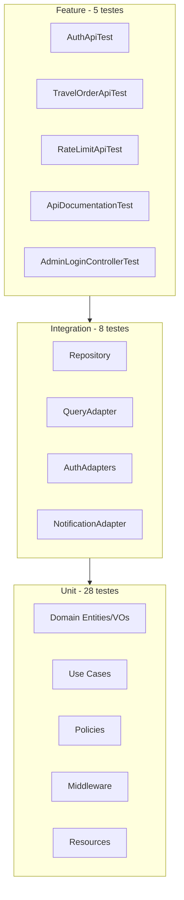

# Testes

Este documento descreve como executar, estruturar e escrever testes no projeto.

## Executando testes

### Via Make (recomendado)

```bash
make artisan cmd="test"
```

### Dentro do container

```bash
make shell
php artisan test
```

### Filtros úteis

```bash
# Apenas uma suite
php artisan test --testsuite=Unit
php artisan test --testsuite=Integration
php artisan test --testsuite=Feature

# Arquivo ou método específico
php artisan test tests/Unit/Domain/TravelOrder/TravelOrderTest.php
php artisan test --filter=test_admin_can_approve_order

# Com cobertura mínima de 100% (requer Xdebug ou PCOV)
php artisan test --coverage --min=100
```

## CI (GitHub Actions)

Pull requests para a branch `main` disparam o workflow [`.github/workflows/tests.yml`](../.github/workflows/tests.yml), que:

1. Instala dependências com Composer (PHP 8.4 + PCOV)
2. Executa `php artisan test --coverage --min=100`

O PR só deve ser mergeado com esse check verde. A cobertura considera os diretórios definidos em `phpunit.xml` (`Domain`, `Application`, `Infrastructure`, `Http`, `Notifications`), excluindo interfaces de ports/repositórios e providers.

## Configuração (`phpunit.xml`)

| Configuração | Valor | Motivo |
|--------------|-------|--------|
| `DB_CONNECTION` | `sqlite` | Banco em memória, rápido e isolado |
| `DB_DATABASE` | `:memory:` | Sem dependência do MySQL Docker |
| `QUEUE_CONNECTION` | `sync` | Jobs executam imediatamente |
| `MAIL_MAILER` | `array` | E-mails capturados, não enviados |
| `CACHE_STORE` | `array` | Cache em memória |
| `SESSION_DRIVER` | `array` | Sessão em memória |

## Pirâmide de testes

O projeto possui **41 classes de teste** distribuídas em 3 suites:



### Feature (5 classes) — fluxos HTTP end-to-end

Testam a API completa: rota → controller → use case → resposta HTTP.

| Arquivo | Cobertura |
|---------|-----------|
| `tests/Feature/Http/Auth/AuthApiTest.php` | register, login, logout |
| `tests/Feature/Http/TravelOrder/TravelOrderApiTest.php` | CRUD + notificações |
| `tests/Feature/Http/RateLimitApiTest.php` | 429 em auth, api, web-login, docs |
| `tests/Feature/Http/ApiDocumentationTest.php` | acesso Scramble, spec OpenAPI |
| `tests/Feature/Http/AdminLoginControllerTest.php` | login web admin |

**Base class:** `Tests\TestCase` com `RefreshDatabase`.

### Integration (8 classes) — banco e adapters reais

Testam persistência e adapters com banco SQLite real.

| Arquivo | Cobertura |
|---------|-----------|
| `EloquentTravelOrderRepositoryTest` | save/find de pedidos |
| `EloquentTravelOrderListQueryAdapterTest` | listagem com filtros |
| `TravelOrderModelTest` | model Eloquent |
| `TravelOrderEloquentTranslatorTest` | mapper Eloquent ↔ Domain |
| `EloquentUserAuthenticationAdapterTest` | autenticação |
| `SanctumApiTokenAdapterTest` | tokens Sanctum |
| `LaravelNotificationAdapterTest` | envio de notificações |

**Base class:** `Tests\TestCase` com `RefreshDatabase`.

### Unit (~28 classes) — lógica isolada

Testam domínio, use cases e componentes sem banco (com mocks).

| Camada | Exemplos |
|--------|----------|
| Domain | `TravelOrderTest`, value objects, `TravelOrderCollectionTest` |
| Application | Use cases, listeners de notificação |
| Infrastructure | Adapters, facades (com mocks) |
| Http | Resources, middlewares, extensão Scramble |
| Policies | `TravelOrderPolicyTest` |
| Notifications | `TravelOrderApprovedNotificationTest` |

**Base classes:**
- `Tests\Unit\UnitTestCase` — PHPUnit puro + Mockery (use cases)
- `Tests\TestCase` — quando precisa do container Laravel

## Cobertura de código

Configurada em `phpunit.xml`:

**Incluídas:**
- `app/Domain`
- `app/Application`
- `app/Infrastructure`
- `app/Http`
- `app/Notifications`

**Excluídas:**
- Interfaces de repositório (`Domain/TravelOrder/Repositories`)
- Ports (`Application/Ports`)
- `Http/Controllers/Controller.php`
- Providers (`app/Providers`)

```bash
php artisan test --coverage
```

## Fakes e mocks

### Laravel Fakes (Feature tests)

```php
Event::fake([TravelOrderApproved::class]);
Mail::fake();
Notification::fake();
Queue::fake();
```

### Mockery (Unit tests de use cases)

```php
$repository = Mockery::mock(TravelOrderRepositoryInterface::class);
$repository->shouldReceive('findById')->andReturn($order);

$useCase = new UpdateTravelOrderStatusUseCase($repository, $eventDispatcher);
```

## Como escrever novos testes

### Teste de domínio (Unit)

```php
// tests/Unit/Domain/TravelOrder/TravelOrderTest.php
public function test_cannot_approve_already_approved_order(): void
{
    $order = TravelOrder::reconstitute(/* ... status: Aprovado */);

    $this->expectException(InvalidTravelOrderStateException::class);
    $order->approve();
}
```

Use `Tests\Unit\UnitTestCase` — sem banco, sem container Laravel.

### Teste de use case (Unit)

```php
// tests/Unit/Application/TravelOrder/CreateTravelOrderUseCaseTest.php
public function test_creates_travel_order_for_authenticated_user(): void
{
    $repository = Mockery::mock(TravelOrderRepositoryInterface::class);
    $repository->shouldReceive('save')->once();

    $authenticatedUser = Mockery::mock(AuthenticatedUserPort::class);
    // ... configurar mocks

    $useCase = new CreateTravelOrderUseCase($repository, $authenticatedUser);
    $output = $useCase->execute($input);

    $this->assertNotNull($output->order);
}
```

### Teste de integração

```php
// tests/Integration/Infrastructure/Persistence/EloquentTravelOrderRepositoryTest.php
use RefreshDatabase;

public function test_saves_and_finds_travel_order(): void
{
    $user = UserModel::factory()->create();
    $order = TravelOrder::create(/* ... */);

    $this->repository->save($order);
    $found = $this->repository->findById($order->id());

    $this->assertNotNull($found);
    $this->assertTrue($found->id()->equals($order->id()));
}
```

Use factories — nunca dados hardcoded.

### Teste de feature (API)

```php
// tests/Feature/Http/TravelOrder/TravelOrderApiTest.php
use RefreshDatabase;

public function test_authenticated_user_can_create_travel_order(): void
{
    $user = UserModel::factory()->create();

    $response = $this->actingAs($user, 'sanctum')
        ->postJson('/api/v1/travel-orders', [
            'destination' => 'São Paulo',
            'departure_date' => '2026-07-01',
            'return_date' => '2026-07-10',
        ]);

    $response->assertCreated();
    $this->assertDatabaseHas('travel_orders', ['destination' => 'São Paulo']);
}
```

## Convenções de nomenclatura

- Métodos: `test_<quem>_<ação>_<resultado_esperado>`
- Exemplo: `test_regular_user_cannot_approve_order`
- Padrão **Arrange → Act → Assert** com linhas em branco entre blocos
- Um conceito principal por teste

## Factories disponíveis

| Factory | States úteis |
|---------|-------------|
| `UserModel::factory()` | `->admin()`, `->unverified()` |
| `TravelOrderModel::factory()` | `->approved()`, `->cancelled()` |

```php
$admin = UserModel::factory()->admin()->create();
$order = TravelOrderModel::factory()->for($user)->approved()->create();
```

## Áreas cobertas

| Área | Suites |
|------|--------|
| Entidades e value objects | Unit |
| Use cases (todos os 8) | Unit |
| Repositórios e query adapters | Integration |
| API REST completa | Feature |
| Autenticação Sanctum | Feature + Integration |
| Policies e autorização | Unit + Feature |
| Notificações | Unit + Integration + Feature |
| Rate limiting | Feature + Unit |
| Documentação OpenAPI (Scramble) | Feature + Unit |
| Middlewares customizados | Unit |

## O que testar ao adicionar features

1. **Domain:** invariantes, transições de estado, value objects
2. **Use Case:** orquestração com mocks (happy path + exceções)
3. **Integration:** persistência real se houver novo repositório/adapter
4. **Feature:** endpoint HTTP com autenticação e autorização
5. **Casos de erro:** 403, 404, 409, 422 conforme aplicável
